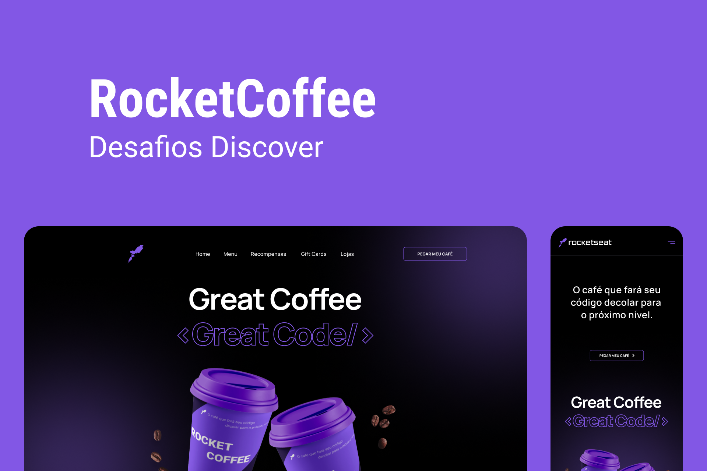

<br>

## Sobre

O projeto **RocketCoffee**,foi desenvolvido com o propósito de treino html, css, e javascript.

Foi utilizado o seguinte layout para o estudo e desenvolvimento do projeto:
https://www.figma.com/file/tFoovGllUttTebdUTDVdT8/RocketCoffee/duplicate

---

## Tecnologias utilizadas

O projeto foi desenvolvido com as seguintes tecnologias:

- HTML5
- SASS
- Javascript

---

## Como baixar o projeto

```bash
    # Clonar repositório
    $ git clone https://github.com/thyago608/rocketcoffee

    # Entrar no diretório da aplicação
    $ cd rocketcoffee

    # Executando a aplicação
    $ Abrir o index.html
```

Desenvolvido por Thyago Ribeiro 👋
